# h4 Maailma kuulee

#### Oma Host kokoonpanoni:

| Komponentti | Kuvaus | Lisätiedot |
| :---        |    :----:   |          ---: |
| Emolevy | MSI B550-A PRO | ATX, AM4 |
| Prosessori   | AMD Ryzen 9 5900X | 12-Core 3.70 GHz |
| RAM   | G.Skill  Ripjaws V |  32GB (4x8GB) DDR4 3600MHz, CL 16, 1.3  |
| Näytönohjain   | Sapphire PULSE AMD Radeon RX 7900 GRE        | 16GB     |
| Kovalevy   | Kingston 1TB        | A2000 NVMe PCIe SSD M.2      |
| Kovalevy   | Crucial 512GB        | MX100 SSD     |
| Kovalevy   | Crucial 256GB        | MX100 SSD     |
| Virtalähde   | Asus 750W TUF Gaming Gold        | ATX 80 Plus      |
| Kotelo   | Phanteks Enthoo Pro       |  Full Tower      |

Käyttöjärjestelmä: Windows 11 Pro 23H2

## x) Lue ja tiivistä. Tiivistelmäksi riittää muutama ranskalainen viiva per artikkeli (ei muuten riittänyt). (Tässä alakohdassa ei tarvitse tehdä testejä tietokoneella)

[Susanna Lehto 2022: Teoriasta käytäntöön pilvipalvelimen avulla (h4) (opiskelijan esimerkkiraportti), kohdat](https://susannalehto.fi/2022/teoriasta-kaytantoon-pilvipalvelimen-avulla-h4/)

Susanna Lehdon vuonna 2022 tekemä tehtävä: 
a) Pilvipalvelimen vuokraus ja asennus
- GitHub Education paketilla voi saada ilmaiseksi palvelimen ja .me-päätteisen domainin väliaikaisesti käyttöön
- DigitalOceaniin täytyy syöttää luottokorttitiedot henkilöllisyyden varmistamiseen 
- Pilvipalvelimen vuokraus alkaa valitsemalla ``Droplets -> Create Droplet``
- Seuraavaksi valitaan käyttöjärjestelmä, tässä tapauksessa mahdollisimman uusi ``Debian``
- Valitaan prosessori, tallennustila, sekä RAM
- Datakeskukseksi valikoitui Amsterdam, koska etäisyys Helsinkiin on 1508km (itse olisin valinnut mieluummin Frankfurtin, jos hinta on sama, sillä merikaapeli kulkee suoraan Helsingistä Saksaan, tämän opin eilen ICT-infra johdantokurssilla. **Cretits:** Pekka Korpi-Tassi)
- Autentikointimenetelmäksi täytyy valita ``salasana`` ellei ``SSH-avaimen`` käyttö ole tuttua. Salasanan tulee olla vahva.
- Mitään ylimääräisiä palveluja ei kannata ottaa, lopuksi annetaan virtuaalikoneelle julkinen nimi, tämän jälkeen ``Create Droplet`` ja odotuksen jälkeen DigitalOcean ilmoittaa pilvikoneen ``IP-osoitteen``

d) Palvelin suojaan palomuurilla

- Aluksi otetaan SSH-yhteys virtuaalipalvelimeen, tässä tapauksessa IP-osoitteessa: 188.166.4.6, käyttäen komentoa: ``$ ssh root@188.166.4.6`` Tässä vaiheessa vahvistuksen jälkeen tulee antaa DigitalOceanissa antama salasana
- Käyttäjä suoritti päivityksen komennolla ``$ sudo apt-get update``, tämän jälkeen palomuurin asennus komennolla  ``$ sudo apt-get install ufw``, reikä palomuuriin komennolla ``$ sudo ufw allow 22/tpc``, palomuuri päälle komennolla ``$ sudo ufw enable``

e) Kotisivut palvelimelle

- Luodaan käyttäjä komennolla ``$ sudo adduser suska``, käyttäjälle annetaan vahva salasana
- Käyttäjästä tehdään pääkäyttäjä komennolla ``$ sudo adduser suska sudo``
- Otettiin SSH-yhteys palvelimeen uudella käyttäjällä ``$ ssh suska@188.166.4.6``, jonka jälkeen taas päivittiin ``$ sudo apt-get update``
- Lukitaan juuri komennolla ``$ sudo usermod –lock root``, jonka jälkeen ``$ sudo apt-get update``, ``$ sudo apt-get upgrade``, ja ``$ sudo apt-get dist-upgrade``
- Asennetaan Apache komennolla ``$ sudo apt-get install apache2``, asennuksen jälkeen ``$ sudo systemctl status apache2``, joka näyttää mm. kuinka kauan apache2 on ollut päällä. Tehtiin toinen reikä palomuuriin komennolla ``$ sudo ufw allow 80/tcp``
- Korvataan Apachen testisivu komennolla ``$ echo Hello world! |sudo tee /var/www/html/index.html``, näin kotisivulla lukee nyt ``Hello world!``
- Terminaalissa otettiin userdir-moduuli käyttöön komennolla ``$ sudo a2enmod userdir``, jonka jälkeen demonin potkaisu komennolla ``$ sudo service apache2 restart`` (**HUOM.** nykyään ``sudo systemctl restart apache2``)
- Suska-käyttäjälle luotiin public_html-kansio, jonka jälkeen Firefoxissa näkyi julkinen hakemisto osoitteessa ``susannalehto.me/~suska``, ennen tätä avattiin SSH-yhteys komennolla ``$ sudo systemctl start ssh``, jonka jälkeen asennettiin micro tekstieditori ``$ sudo apt-get install micro``, public_html-kansiossa luotiin tekstitiedosto ``$ micro index.html``, tänne tehtiin nettisivun runko ja tallennus ``ctrl+s``
- Nettisivuja kokeiltiin vielä Windows-tietokoneen Chrome selaimella ja todettiin toimivaksi

f) Palvelimen ohjelmien päivitys

- Päivitetään kaikki palvelimen ohjelmat
- ``$ sudo apt-get update``, ``$ sudo apt-get upgrade``, ``$ sudo apt-get dist-upgrade``

[Karvinen 2012: First Steps on a New Virtual Private Server – an Example on DigitalOcean and Ubuntu 16.04 LTS](https://terokarvinen.com/2017/first-steps-on-a-new-virtual-private-server-an-example-on-digitalocean/)

Tero Karvisen ohje:
- Luodaan DigitalOceaniin uusi virtuaalipalvelin: ``Luo uusi käyttäjä``, ``Lisää luottokorttitedot ja promo-koodi``, ``Valitse datakeskus, joka on lähellä, mieluiten Euroopassa``
- Ensimmäinen kirjautuminen *root*-käyttäjänä (ainut kerta kun kirjaudutaan kyseisenä käyttäjänä) ``$ ssh root@10.0.0.1``, Anna hyvä salasana kysyttäessä, älä koskaan anna huonoa salasanaa, edes hetkeksi
- Tehdään reikä SSH:hon ennen palomuurin käyttöönottoa ``$ sudo ufw allow 22/tcp``, palomuuri päälle ``$ sudo ufw enable``
- Luodaan järjestelmänvalvojakäyttäjä ``$ sudo adduser tero``, ``$ sudo adduser tero sudo``, ``$ sudo adduser tero adm``, ``$ sudo adduser tero admin``. Kokeillaan käyttäjän toiminta uudella terminaalilla ``$ ssh tero@tero.example.com``
- Suljetaan *root*-käyttäjä ``$ sudo usermod --lock root`` <-- tämä "usermod --lock" ainoastaan lukitsee salasanakirjautumisen, ei kaikkia käyttäjän käyttömahdollisuuksia
- Kielletään *root*-käyttäjä ``$ sudoedit /etc/ssh/sshd_config`` <-- tänne kohtaan: "PermitRootLogin" annetaan arvo: "no", jonka jälkeen ``$ sudo service ssh restart``
- Päivitetään ohjelmistopaketit, jotta vältytään tietoturvauhilta ``$ sudo apt-get update``, ja ``$ sudo apt-get upgrade`` (**HUOM.** käsittääkseni tässä alkuvaiheessa vielä hyvä näiden lisäksi ``$ sudo apt-get dist-upgrade``)
- Voidaan aloittaa palvelimen käyttö esimerkiksi Apache:lla. Muista tehdä reikä palomuuriin ``sudo ufw allow 80/tcp``
- Seuraavaksi tarvitaan vielä nimipalvelu. NameCheap ja Gandi ovat hyviä vaihdoehtoja, jos käytät GitHub Education-pakettia, voit saada ilmaiseksi .me-päätteisen nimen.
- Katso [NameCheap ohje](https://www.namecheap.com/support/knowledgebase/article.aspx/319/2237/how-can-i-set-up-an-a-address-record-for-my-domain/)

## a) Vuokraa oma virtuaalipalvelin haluamaltasi palveluntarjoajalta. (Vaihtoehtona voit käyttää ilmaista kokeilujaksoa, GitHub Education krediittejä; tai jos mikään muu ei onnistu, voit kokeilla ilmaiseksi vagrant:ia paikallisesti. Suosittelen kuitenkin harjoittelemaan oikeilla, tuotantoon kelpaavilla julkisilla palveluilla).

*13.9.2024 klo 14:00*

Selailin hetken suomen kielisiä palvelinvuokraajia ja totesin, että turhan kallista näin alkuun. Joissain jopa olisi pitänyt maksaa 24kk maksu suoraan, tosin taisi olla noin 4€ kuukaudessa, mutta silti.

Päätin siis ottaa ``GitHub Educationin`` kautta [DigitalOceanin](https://www.digitalocean.com/) tarjouksen, jolla saa 200$ käyttörahaa vuoden ajaksi palvelimien vuokraukseen.

Syötin luottokorttitiedot henkilöllisyyden varmistamiseksi. Aloitan palvelimen vuokraamisen painamalla vihreällä pohjalla olevaa "Create" painiketta, jonka dropdown-menusta valitsen "Droplets *Create cloud servers*"

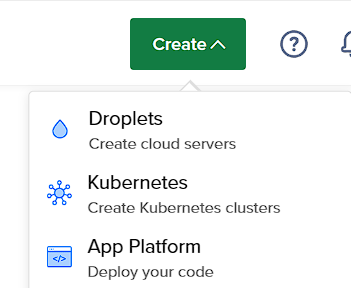

Valitsen palvelimeksi näistä vaihtoehdoista Frankfurt, johtuen siitä, että merikaapeli kulkee suoraan Helsingistä Saksaan, Amsterdam olisi hyvänä kakkosvaihtoehtona. Halutaan, että palvelin on mahdollisimman lähellä. Tässä vaiheessa palvelimen hinta näyttää olevan 32$/kk, mutta ei huolehdita siitä vielä.

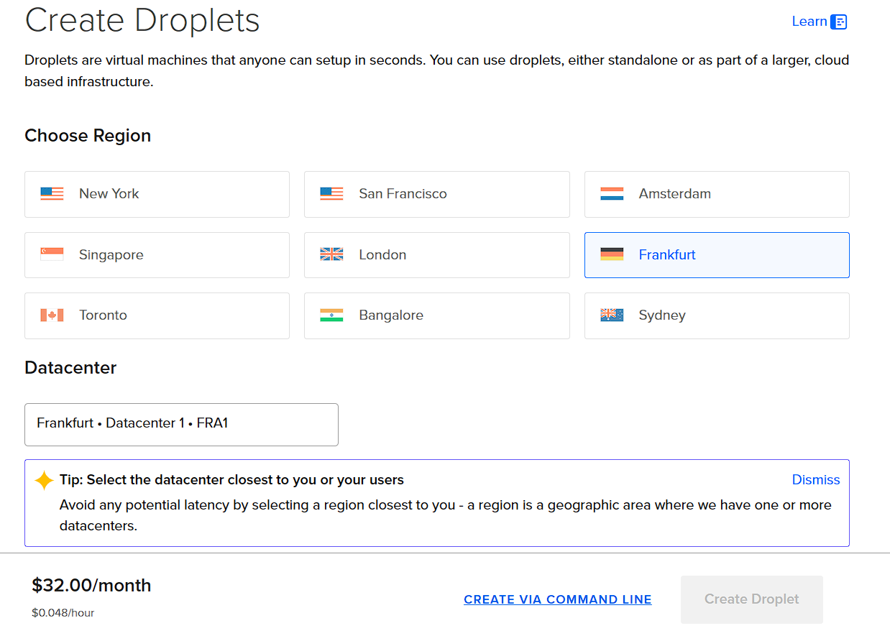

Valitsen Debian V.12 käyttöjärjestelmän ja Basic droplet type - shared CPU

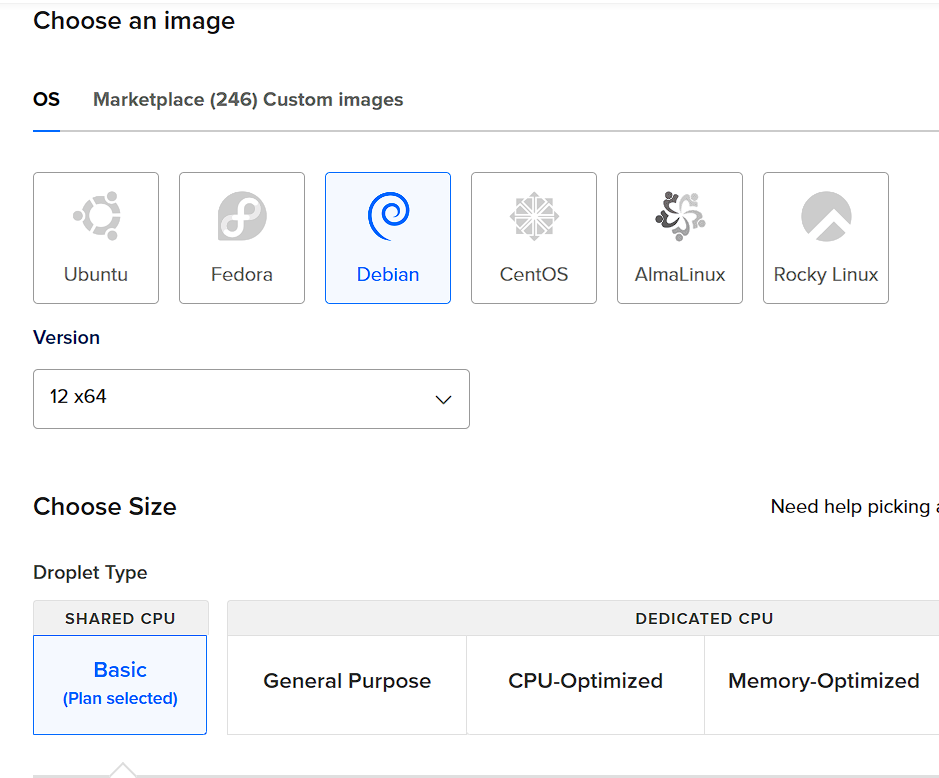

CPU optionsiin valitsen ``Regular, 512MB/1CPU, 10GB SSD, 500GB transfer``, näin saadaan hintaa tiputettua 4$:iin

Valitsen authentication methodiksi ``Password``, sillä en ole vielä käyttänyt SSH-avainta. Tässä kohtaa on hyvä muistaa Tero Karvisen ohje vahvasta salasanasta, käytetään aina vahvaa salasanaa.

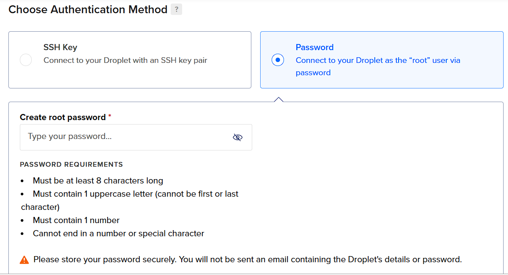

Tämän jälkeen en valitse mitään ylimääräisiä palveluja. ``1 Droplet`` riittää, ``Hostname`` kohtaan laitan jotain neutraalia, koska tämä tulee olemaan julkinen nimi. Tageta ei tarvita. Näiden jälkeen painetaan sinistä painiketta: ``Create Droplet``

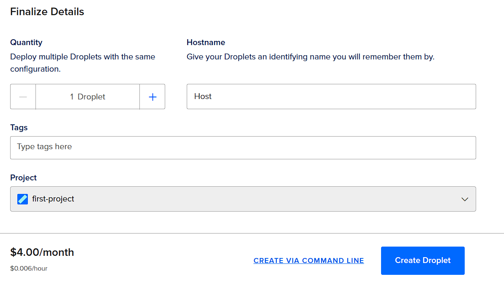

*klo 14:27*

Noin minuutti meni, kun Droplet muodostui, nyt sain palvelimen IP-osoitteen

*valmis klo 14:28, aikaa kului 28min*

## b) Tee alkutoimet omalla virtuaalipalvelimellasi: tulimuuri päälle, root-tunnus kiinni, ohjelmien päivitys.

*klo 14:36*

Aloitetaan alkutoimet, ensin otetaan SSH-yhteys juuri vuokrattuun palvelimeen ``ssh root@167.71.54.154``, vastataan "yes" kysymykseen, annetaan salasana, joka luotiin aiemmin. Tämä on ainoa kerta, kun kirjaudumme *root*-käyttäjällä

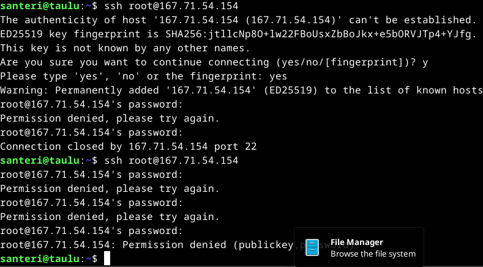

Jostain syystä salasana ei toimi. Yritin vaikka mitä variaatioita, mutta ei päässyt sisään, ainoa vaihtoehdo oli tuhota Droplet ja tehdä uusi samoilla tiedoilla. [3.10.2024, näyttäisi siltä, että SSH-kirjautuminen oli käytössä, vaikka valitsin salasanakirjautumisen]

*klo 14:51 uusi yritys*

Nyt onnistui, sisällä ollaan

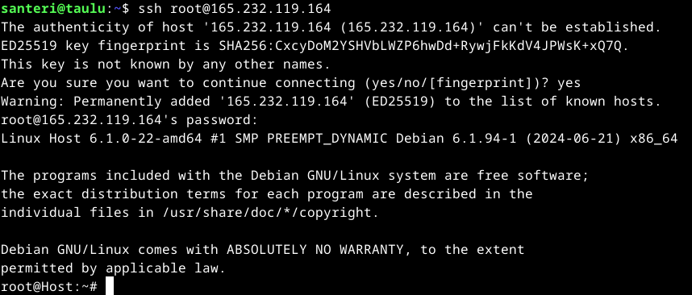

Nyt voidaan alkaa tekemään ensimmäisiä toimintoja palvelimelle.

- Asennetaan palomuuri ``sudo apt-get install ufw``, tehdään reikä palomuuriin ``sudo ufw allow 22/tcp``, laitetaan palomuuri päälle ``sudo ufw enable``

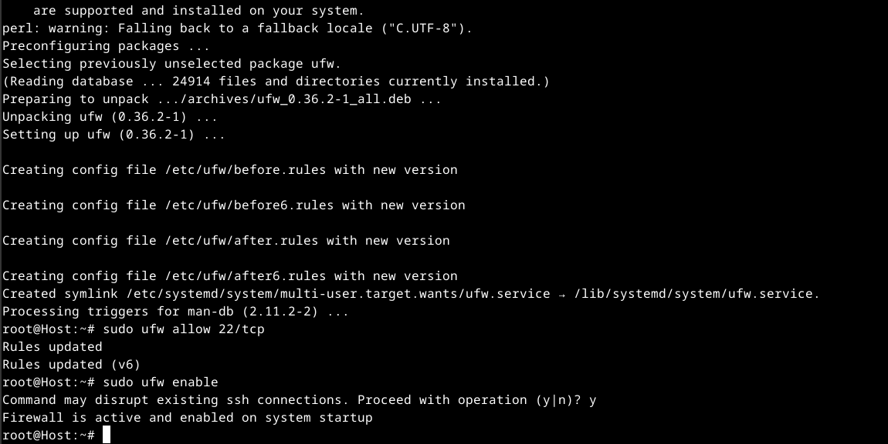

- Luodaan samalla vielä ihmiskäyttäjä, ennen uudelleenkäynnistystä ``sudo adduser santeri``, taas annetaan vahva salasana, "Full Name":een laitoin vaurasan ja jätin muut tiedot tyhjiksi

- Annetaan käyttäjälle oikeuksia ``sudo adduser santeri sudo``, ``sudo adduser santeri adm``, ``sudo adduser santeri admin``

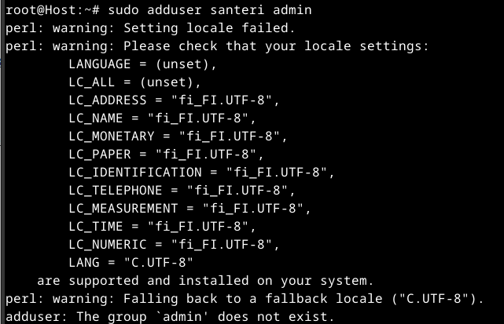

Näistä viimeisin ei toimi, ei ymmärtääkseni tarvitse toimiakaan.

- Bootataan virtuaalikone komennolla ``reboot``

- Kirjauduin nyt luodulla käyttäjällä sisälle ja ajoin päivityksen ``sudo apt-get update`` kokeillakseni, että oikeudet toimivat

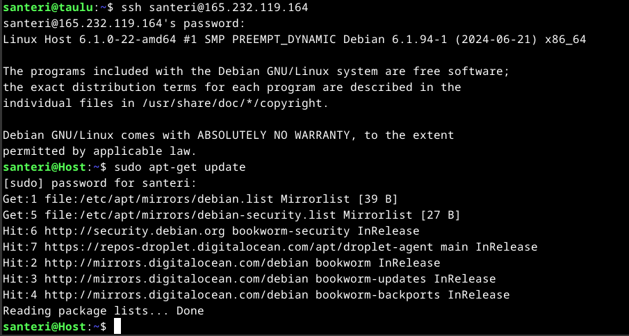

- Kuka olen ja missä olen?

- Nyt voidaan sulkea *root*-käyttäjän SSH-yhteys. ``sudo usermod --lock root`` komennolla saadaan root-salasana pois. Nyt mennään ``sudoedit /etc/ssh/sshd_config``, ja muutetaan ``PermitRootLogin no`` "ctrl+s" tallennetaan tiedosto ja "ctrl+x" exit editor. Näin saadaan root lukittua. Tämän jälkeen vielä ``sudo service ssh restart``

- Nyt päivitellään ohjelmat komennoilla ``sudo apt-get update``, ``sudo apt-get upgrade``, ja ``sudo apt-get dist-upgrade``. Muutaman minuutin kuluttua kaikki ohjelmat ovat päivitetty.

*klo 15:26, yllättäen aikaa kului 50min kaikkine säätöineen*

## c) Asenna weppipalvelin omalle virtuaalipalvelimellesi. Korvaa testisivu. Kokeile, että se näkyy julkisesti. Kokeile myös eri koneelta, esim kännykältä.

*klo 16:59*

- Asennetaan Apache2 komennolla ``sudo apt-get install apache2``, varmuudeksi päivitetään kaikki ``sudo apt-get update``, tarkistan apachen tilan ``sudo systemctl status apache2``

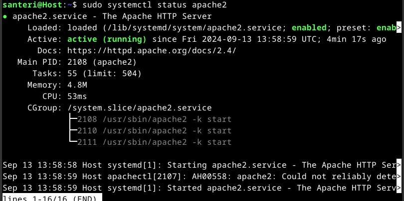

Kello on näemmä väärässä ajassa, joten yritän vaihtaa sen vastaamaan nykyistä Suomen kesäaikaa UTC+3. Löysin ohjeet ensin ChatGPT:n avulla, komento näytti niin hämärältä, että oli pakko etsiä toisesta lähteestä. Debian wiki näytti samaa komentoa, joten uskalsin käyttää ``sudo dpkg-reconfigure tzdata``, sieltä valitsin "Europe", ja "Helsinki"

Aika ei näyttänyt muuttuvan, joten käynnistin palvelimen uusiksi ``sudo reboot``

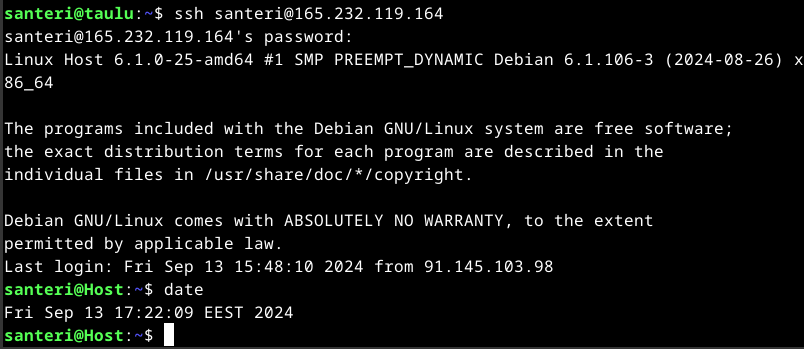

Nyt kellonaika näyttää oikealta, voidaan jatkaa työskentelyä. Teen reiän palomuuriin ``sudo ufw allow 80/tcp``

Päällekirjoitetaan apachen testisivu ``echo Testisivu|sudo tee /var/www/html/index.html`` ja potkaistaan demonia ``sudo systemctl restart apache2`` 
Menin Windowsin Chrome selaimella osoitteeseen ``http://165.232.119.164/``, siellä näkyy nyt kyseinen Testisivu

Tehdään nyt suoraan hieman järkevämmäksi tämä muuttamalla tuo testisivu uuteen muotoon ``sudo micro /var/www/html/index.html`` ja päällekirjoitetaan "Testisivu" teksti

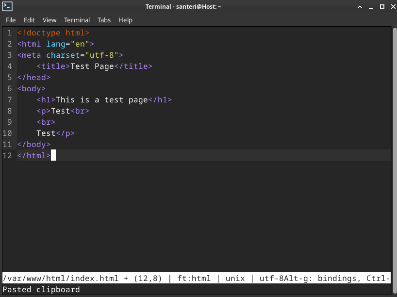

Potkaistaan vielä demonia ``sudo systemctl restart apache2``, Chromessa näyttää tältä

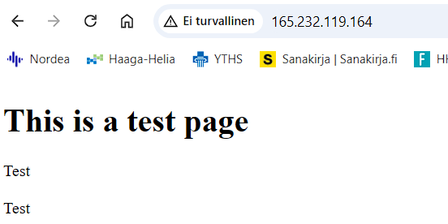

Ja kännykällä tältä

*valmis klo 17:46, aikaa kului 47min* 
*14.9.2024 klo 14:17 lisätty rivinvaihto tekstin alkuun*

## Lähteet

Debian. wiki. https://wiki.debian.org/DateTime 
Debian. wiki. https://wiki.debian.org/TimeZoneChanges#Commit_Change 
DigitalOcean. https://www.digitalocean.com/ 
GitHub Education. https://education.github.com/learner/learn 
Karvinen, T. h4 Maailma kuulee. https://terokarvinen.com/linux-palvelimet/#h4-maailma-kuulee 
Lehto, S. 2022. Teoriasta Käytäntöön Pilvipalvelimen avulla h4. https://susannalehto.fi/2022/teoriasta-kaytantoon-pilvipalvelimen-avulla-h4/

---

Tätä dokumenttia saa kopioida ja muokata GNU General Public License (versio 2 tai uudempi) mukaisesti. http://www.gnu.org/licenses/gpl.html 
Pohjana Tero Karvinen 2012: Linux kurssi, http://terokarvinen.com  
Kirjoittanut <em>Santeri Vauramo</em>, 2024
