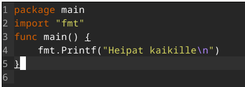
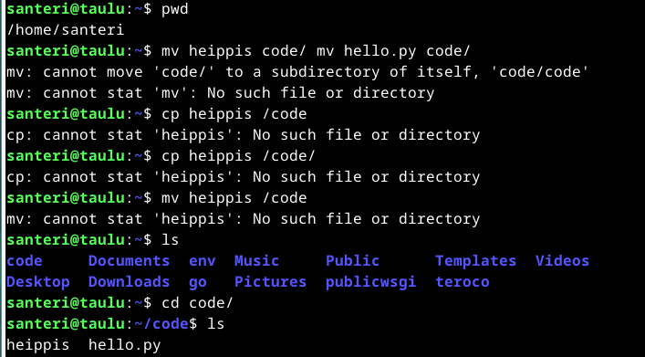
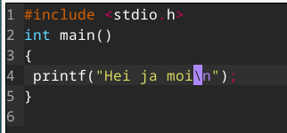
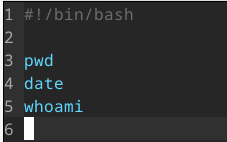
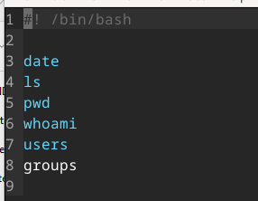
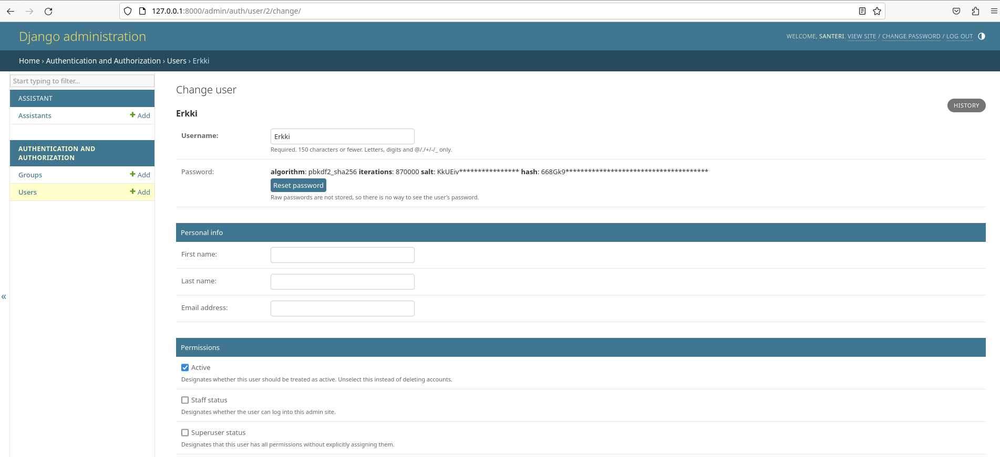

# h7 Maalisuora

#### Oma Host kokoonpanoni:

| Komponentti | Kuvaus | Lisätiedot |
| :---        |    :----:   |          ---: |
| Emolevy | MSI B550-A PRO | ATX, AM4 |
| Prosessori   | AMD Ryzen 9 5900X | 12-Core 3.70 GHz |
| RAM   | G.Skill  Ripjaws V |  32GB (4x8GB) DDR4 3600MHz, CL 16, 1.3  |
| Näytönohjain   | Sapphire PULSE AMD Radeon RX 7900 GRE        | 16GB     |
| Kovalevy   | Kingston 1TB        | A2000 NVMe PCIe SSD M.2      |
| Kovalevy   | Crucial 512GB        | MX100 SSD     |
| Kovalevy   | Crucial 256GB        | MX100 SSD     |
| Virtalähde   | Asus 750W TUF Gaming Gold        | ATX 80 Plus      |
| Kotelo   | Phanteks Enthoo Pro       |  Full Tower      |

Käyttöjärjestelmä: Windows 11 Pro 23H2

#### Virtuaalikone
Oracle VirtualBox 7 - Debian 12 GNU/Linux bookworm 
6 Prosessoriydintä - 4GB RAM-muistia - 60GB tallennustilaa

## a)

#### Kirjoita ja aja "Hei maailma" kolmella kielellä

Ohjelmointitaidot ovat kohtalaisen ruosteessa, joten käytän röyhkeästi apuna Karvisen [Hello World Python3, Bash, C, C++, Go, Lua, Ruby, Java – Programming Languages on Ubuntu 18.04 ohjetta](https://terokarvinen.com/2018/hello-python3-bash-c-c-go-lua-ruby-java-programming-languages-on-ubuntu-18-04/)

*3.10.2024 klo 13:01*

### Python

Pikaisen vilkaisun jälkeen otan ensimmäisenä käsittelyyn vanhan kunnon Pythonin. Luon python tiedoston ``micro hello.py``. Kirjoitan tiedostoon: print("Heippa muailma") ja tallennan ``ctrl+s´´

Sitten ajetaan tiedosto ``python3 hello.py``

### Go

Seuraavana tuo Go vaikuttaisi järkevältä. Täytyy ensin asentaa golang-go komennolla ``sudo apt-get -y install golang-go``, hetken rullauksen jälkeen ohjelma on asennettu.

Kokeilen luoda go-tiedoston ``micro heippis.go``, tiedostoon kirjoitan:

Kokeilen luoda "hei.go" tiedostoa tuon pohjalta komennolla ``go build -o heippis.go hei.go``, mutta ei onnistu. Veikkaan että johtuu alkuperäisen tiedoston nimestä ".go"-päätteellä kokeilen muuttaa "heippis.go" tiedoston --> "heippis"

``mv heippis.go heippis``. Huomaan että olen tehnyt nämä suoraan /home/santeri kansioon, tämä ei vetele, joten teen "code/" kansion minne siirrän nämä. ``mkdir code``, ei sentään c0de, eikä myöskään sammy, ``mv heippis code/ mv hello.py code/``, ihme herjoja tuli, mutta tiedostot siirtyivät /code kansioon

*Älkööt välittäkö teroco/ kansiosta, nothing to see here.* Ei pysty vieläkään käyttämään komentoa ``go build -o heippis heippis.go``, otetaanpa manuaali esille https://go.dev/doc/tutorial/getting-started#call.

Nyt kokeilen suoraan raa'asti ohjeen mukaan ``go mod init example/hello``

Teen "heippis":stä takaisin "heippis.go" tiedoston ``mv heippis heippis.go`` ja avaan sen microlla ``micro heippis.go``

Taas tämä sama, eli

- ensimmäisenä määritellään main paketti, paketti on ryhmä funktioita
- tuodaan suosittu ftm paketti joka sisältää functioita joilla alustetaan tekstiä, kuten tulostetaan tekstiä konsoliin
- käytetään main funktiota tulostamaan viesti konsoliin, main funktio suoritetaan oletuksena kun suoritetaan main paketti

Ohjeen mukaan ajoin seuraavaksi ``go mod tidy``, tästä en ole varma oliko pakollinen vaihe. Seuraavaksi komennolla ``go run .`` sain ajettua tuon koodin oikein.

### C

Tästäkään kielestä ei ole kokemusta, paitsi C# alkeita on joskus tullut opeteltua, joten ainakin Karvisen ohje on paikallaan. Katson syventäviä ohjeita vielä täältä: https://www.scaler.com/topics/c/how-to-compile-c-program-in-linux/

``micro heitaas.c``, luon uuden c tiedoston, jonne kirjoitan:

Täytyy vielä laatia .c-tiedostosta ohjelma ``gcc heitaas.c -o heitaasc``, nyt ohjelmaa voidaan ajaa komennolla ``./heitaasc``

*klo 13:40, 39min kaikkineen*

## b)

#### Laita Linuxiin uusi komento niin, että kaikki käyttäjät voivat ajaa sitä

Luen alkuun [Karvisen ohjeita aiheesta](https://terokarvinen.com/2007/12/04/shell-scripting-4/), vaikka tämä käytiin jo tunnilla läpi ja tein muistiinpanoja

Olipa lyhyt ohje, homma tuli selväksi, mutta yritän löytää pidemmän tekstin jossa selitetään hieman teoriaa taustalla, kuten tämä https://www.geeksforgeeks.org/shell-scripting-define-bin-bash/

*klo 13:56*

Eipä siihen sen enempää kaiketi ohjeita tarvita. Luon code/ kansioon uuden tiedoston ``micro kukamita.sh`` ja kirjoitan seuraavaa:

Annan kaikille oikeudet suorittaa tiedosto komennolla ``chmod a+x kukamita.sh``, jonka jälkeen suoritetaan tiedosto komennolla ``bash kukamita.sh``

*klo 13:59*

[ *7.10.2024*

Ehdin jo poistaa tuon virtuaalikoneen ja nyt asentelen laboratorioharjoitusta varten uutta. Tajusin, että tuo "kukamita.sh" piti vielä kopioida pääkäyttäjänä ``/usr/local/bin/`` kansioon

Tämä olisi suoritettu komennolla ``sudo cp kukamita.sh /usr/local/bin/``]

## c)

#### Ratkaise vanha arvioitava laboratorioharjoitus soveltuvin osin

Etsin sopivan laboratorioharjoituksen hakukentästä "lab" haulla

Alimpana tuolla haulla löytyi järkevän oloinen [Final Lab for Linux Palvelimet 2024 Spring](https://terokarvinen.com/2024/arvioitava-laboratorioharjoitus-2024-linux-palvelimet/?fromSearch=lab) labraharjoitus

Aloitan laboratorioharjoituksen d) kohdasta, sillä a-c on oikeaan koetilanteeseen tarkoitettuja asioita. Kirjoitan jonkun verran yksityiskohtaista raporttia, tai ainakin otan kuvia, vaikka tuon laboratorioharjoituksen tehtävänannossa sanotaan, että lähinnä testitulokset riittää

Tietenkin vielä täytyy asentaa täysin uusi virtuaalikone tätä tehtävää varten, joten siinä menee hetki. Tein tämän jo kertaalleen hiljattain, joten pitäisi olla hyvässä muistissa asia, siitä en raportoi kuitenkaan, ellei tule mutkia matkaan. Laitan tällä kertaa virtuaalikoneeseen 6 ydintä ja 8GB muistia, koska niitä riittää

### - d) 'howdy'

#### - Tee kaikkien käyttäjien käyttöön komento 'howdy'
#### - Tulosta haluamaasi ajankohtaista tietoa, esim päivämäärä, koneen osoite tms
#### - Pelkkä "hei maailma" ei riitä
#### - Komennon tulee toimia kaikilla käyttäjillä työhakemistosta riippumatta

*14:32*

Loin howdy.sh ``micro howdy.sh`` ja sinne

*klo 14:39*

[ *7.10.2024*

Tässä tietenkin sama kopiointi jäi ajamatta, eli ``sudo cp howdy.sh /usr/local/bin/`` ]

### - e) Etusivu uusiksi

#### - Asenna Apache-weppipalvelin
#### - Tee yrityksellemme "AI Kakone" kotisivu
#### - Kotisivu tulee näkyä koneesi IP-osoitteella suoraan etusivulla
#### - Sivua pitää päästä muokkaamaan normaalin käyttäjän oikeuksin (ilman sudoa). Liitä raporttiisi listaus tarvittavien tiedostojen ja kansioiden oikeuksista.

Laitoin oikeudet ``chmod -R 750 /var/www`` ja ``sudo chown -R santeri:santeri /var/www``

### - g) Salattua hallintaa  127.0.0.1

#### - Asenna ssh-palvelin
#### - Tee uusi käyttäjä omalla nimelläsi, esim. minä tekisin "Tero Karvinen test", login name: "terote01"
#### - Automatisoi ssh-kirjautuminen julkisen avaimen menetelmällä, niin että et tarvitse salasanoja, kun kirjaudut sisään. Voit käyttää kirjautumiseen localhost-osoitetta

Katsoin ohjeita täältä: https://terokarvinen.com/2008/03/10/ssh-public-key-authentication-2/?fromSearch=ssh

``sudo apt-get install ssh``

``cd /home/santerite01/.ssh``

``ssh-keygen -t dsa``

### - h) Djangon lahjat
#### - Asenna omalle käyttäjällesi Django-kehitysympäristö
#### - Tee tietokantaan lista tekoälyistämme, jossa on nämä ominaisuudet
#### - Kirjautuminen salasanalla
#### - Tietokannan muokkaus wepissä Djangon omalla ylläpitoliittymällä (Django admin)
#### - Käyttäjä Erkille, jossa ei ole ylläpito-oikeuksia
#### - Taulu Assistants, jossa jokaisella tietueella on nimi (name)
#### - Jos haluat, voit lisäksi bonuksena laittaa mukaan kentän koko (size)

Lähden tekemään tätä ohjetta soveltaen https://terokarvinen.com/2022/django-instant-crm-tutorial/

Tämmöistä sain tehtyä, en ole täysin varma oliko tässä kaikki mitä haettiin, lukuunottamatta "size"-kenttää

---

---

### - h) Tuotantopropelli

#### - Jos olet tässä kohdassa, olet kyllä työskennellyt todella nopeasti (tai sitten teet tätä tehtävää huviksesi kurssin jälkeen). Mutta älä huoli, tässä haastetta, jotta et joudu pyörittelemään peukaloita.
#### - Tee tuotantotyyppinen asennus Djangosta
#### - Laita Django-lahjatietokanta tuotantotyyppiseen asennukseen
#### - Voit vaihtaa tämän sivun näkymään etusivulla staattisen sivun sijasta

Tämä ohje on kovassa käytössä tätä tehtäessä https://terokarvinen.com/2022/deploy-django/

Kuvassa näkyy lahjatietokanta apachen pyörittämänä admin-näkymässä, viimeinen kohta tehtävästä jäi tekemättä

## d)

#### Asenna itsellesi tyhjä virtuaalikone arvioitavaa labraa varten. Suosittelen Debian 12-Bookworm amd64, riittävästi RAM ja kovalevyä. Koneella saa olla päivitetyt ohjelmistot (apt-get dist-upgrade) ja tulimuuri. Koneella ei saa olla mitään muita demoneja tai ohjelmia asennettuna kuin nuo ja asennuksen mukana tulevat. Virtuaalikoneella ei saa olla luottamuksellisia tiedostoja, koska opettaja saattaa tarkastella sitä. [Update 2024-10-03 w40 Thu: Tästä d-osioista ei tarvitse kirjoittaa raporttia. Koneelle voi asentaa haluamansa graafisen käyttöliittymän oletusasetuksilla, suosittelen xfce-työpöytää.]

Tähän ohjeet alkavat olemaan jo päässä aika hyvin, mutta ohjeet asennukseen löytyvät täältä: https://terokarvinen.com/2021/install-debian-on-virtualbox/

Tehtävänannon mukaan tästä ei tarvitse kirjoittaa raporttia, joten raportoin vain sen, että asennan ainoastaan tehtävänannossa sallitun tulimuurin ja päivitän kaiken ``sudo apt-get dist-upgrade``. Lisäksi haluan paremman resoluution, ja että voin kopioida asioita oman tietokoneen ja virtuaalikoneen välillä, joten asensin VBox Guest additionsin

Siellä on nyt LabRat odottamassa tositoimia

## Lähteet

Chandra, A. How to Compile C Program in Linux?. Luettavissa: https://www.scaler.com/topics/c/how-to-compile-c-program-in-linux/. Luettu 3.10.2024 
Geeksforgeeks. Shell Scripting – Define #!/bin/bash. Luettavissa: https://www.geeksforgeeks.org/shell-scripting-define-bin-bash/. Luettu 3.10.2024 
Go Dev. Tutorial: Get started with Go. Luettavissa: https://go.dev/doc/tutorial/getting-started#call. Luettu 3.10.2024 
Karvinen, T 2007. Shell Scripting. Luettavissa: https://terokarvinen.com/2007/12/04/shell-scripting-4/. Luettu 3.10.2024 
Karvinen, T 2018. Hello World Python3, Bash, C, C++, Go, Lua, Ruby, Java – Programming Languages on Ubuntu 18.04. Luettavissa: https://terokarvinen.com/2018/hello-python3-bash-c-c-go-lua-ruby-java-programming-languages-on-ubuntu-18-04/. Luettu 3.10.2024 
Karvinen, T. 2021 Install Debian on Virtualbox. Luettavissa: https://terokarvinen.com/2021/install-debian-on-virtualbox/. Luettu 7.10.2024

---

Tätä dokumenttia saa kopioida ja muokata GNU General Public License (versio 2 tai uudempi) mukaisesti. http://www.gnu.org/licenses/gpl.html 
Pohjana Tero Karvinen 2012: Linux kurssi, http://terokarvinen.com  
Kirjoittanut <em>Santeri Vauramo</em>, 2024
